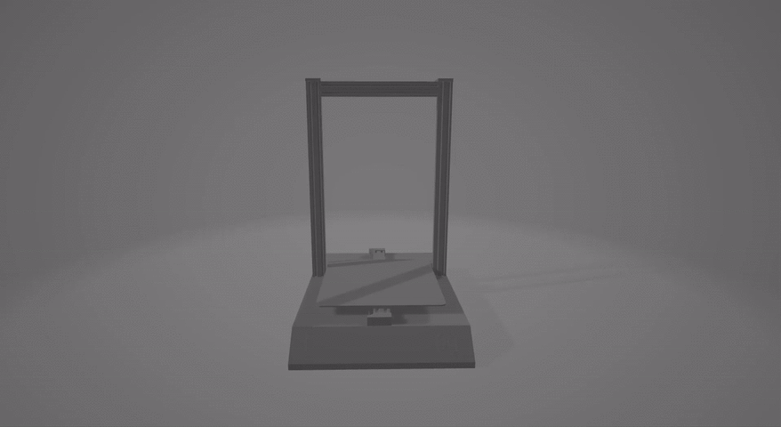

# Cura Printer Profile for Artillery Sidewinder X1

| Supported Printer       |
| -----------------       |
| Artillery Genius        |
| Artillery Sidewinder X1 (all versions) |
| Artillery Sidewinder X2 |

### General Information
Since ```Cura v4.8``` the Artillery Sidewinder X1 and Genius is supported by default.

If you dont't like the 3D Model of the Artillery Sidewinder X1 shipped with Cura 4.8 and newer
you can copy a high-res 3D Model from ```src/meshes``` to ```C:\Program Files\Ultimaker Cura 4.7\resources\meshes```.


### Installation
Go to your installation folder of Cura. Usually found under ```C:\Program Files\Ultimaker Cura 4.7\resources```. </br>

Copy the folders from ```/src``` to their respective folders: </br>
```\resources\definitions``` </br>
```\resources\extruders``` </br>
```\resources\meshes``` </br>

[Import of Printer Profiles into Cura](https://support.ultimaker.com/hc/en-us/articles/360012480959-How-to-manage-printing-profiles-in-Ultimaker-Cura)

Printer profiles can be found under ```/printer-profiles```.

---

